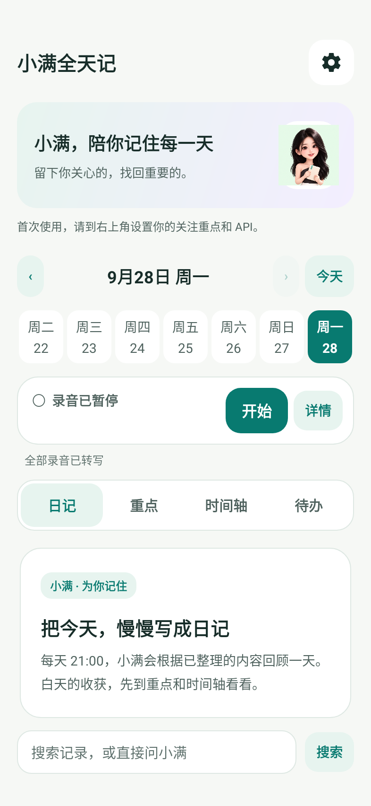
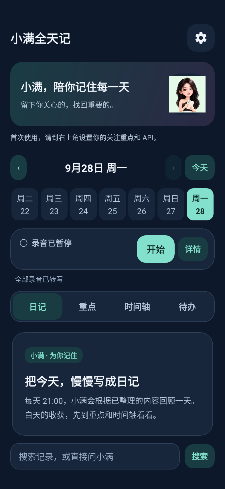
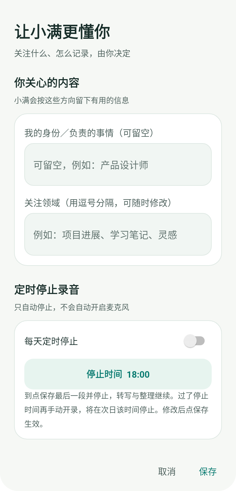
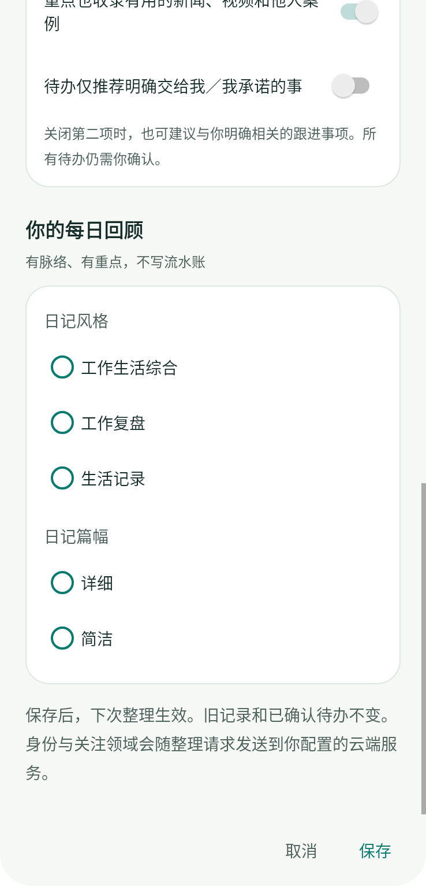

# 小满全天记

**开启记录，按你的关注方向提取重点；自动整理时间轴、待办建议和每日 AI 日记。**

小满全天记是一款 Android 智能记录应用，适合需要回顾讨论、跟进项目、积累学习内容与灵感的个人用户。你先设置希望留下的信息，再主动开启手机收音；小满将录音转成文字，筛选有用内容，按时间和主题整理，供你回顾、搜索和提问。

在「时间轴」看发生了什么，在「重点」看同一事项的进展，在「待办」决定哪些事需要自己跟进。晚上生成当天的结构化日记，授权后可将日记全文自动写入系统日历。

[**直接下载 Android APK**](https://github.com/haiyunw98-cloud/xiaoman-allday/releases/download/v0.1.2-public/xiaoman-allday-0.1.2-public.apk) · [产品界面](UI.md) · [首次使用](#首次使用) · [版本说明](https://github.com/haiyunw98-cloud/xiaoman-allday/releases/tag/v0.1.2-public) · [反馈问题](https://github.com/haiyunw98-cloud/xiaoman-allday/issues/new/choose)

Android 13 及以上 · ARM64 · v0.1.2-public 公开体验版 · 安装包约 272 MB，内含本地中文转写模型

## 开启之后，小满具体做什么

1. **记录声音。** 首页点「开始」后，手机麦克风持续收音，约每 5 分钟保存一段。首页和录音通知均可暂停；暂停时保存当前片段。
2. **筛选人声并转写。** 持续录音期间，每累计 3 段触发一批处理，约为 15 分钟；暂停保存片段时也会触发处理。先在本地筛选人声，再用 SenseVoice 转成文字。
3. **提取有用内容。** 一批转写结束后，将文字交给你配置的云端 AI，结合关注方向提取事实、讨论要点、决定、计划和有价值的见闻，过滤无信息量的寒暄、噪声和重复内容。
4. **组织整理结果。** 新信息进入时间轴和重点；中午、傍晚再合并相关重点并生成待办建议；晚上依据整理结果生成日记。

「挑重点记录」是**收音、转写后筛选和整理信息**，不是录音前就判断一句话是否重要。约 15 分钟是批次触发间隔，不是结果完成时限；实际耗时取决于手机性能、语音量、积压任务和云端响应。

## 六项核心功能

### 1. 关注领域：决定哪些信息值得留下

右上角齿轮 →「关注重点与使用习惯」，填写「我的身份／负责的事情」和「关注领域」。身份可留空，关注领域用逗号分隔，可随时修改。

| 使用方向 | 可填写的关注内容示例 |
| --- | --- |
| 项目跟进 | 项目进度、需求变更、交付时间、预算、风险、责任分工 |
| 学习积累 | 专业概念、方法步骤、案例、书籍观点、待查问题 |
| 创作与研究 | 选题、灵感、用户反馈、产品思路、值得验证的观点 |

这些是配置示例，不是预置记录或识别结果。偏好保存后用于下一次整理，不会改写旧记录或已经确认的待办。

有用的新闻、视频和他人案例也可进入重点，并要求区分来源；这一选项可关闭。媒体见闻与现实事项分开整理，不应仅因话题与你有关，就把视频里他人的任务当成你的待办。

### 2. 时间轴：按时间找回有用信息

「时间轴」展示经过提取的内容，而不是把原始转写全文堆在首页。

- **按日期查看：** 点击日期栏、前后翻页或日期选择器，回顾某一天。
- **按时段浏览：** 最新时段优先；分组显示数量，可展开，也可点击内容收起。
- **保留事情发生的时间：** 便于查找某次讨论、想法或进展，回到当时的上下文。
- **区分现实与见闻：** 新闻、视频等媒体信息单独呈现。

适合查找「上午讨论了哪些事」「那个想法是什么时候提到的」，不必从一整天的长文本开始找。

### 3. 重点：将同一事项的多段信息归纳到一起

每批整理可新增重点；到合并时间，再把同一主题的片段归纳到一起，减少相似条目反复出现。

- **12:30：** 合并上午截至该时点的重点。
- **18:00：** 合并当天截至该时点已有的重点，包括上午内容。
- **合并成功：** 合并结果替换参与合并的条目，不再额外叠加一份摘要；未参与合并的内容保留。
- **合并失败：** 保留原内容并重试，避免因整理失败丢失信息。

内容围绕背景、进展、讨论要点、结论和后续关注展开。**重点自动收录，不需要确认。** 18:00 后的新记录仍会进入时间轴和重点，不代表当天停止收音。

### 4. 待办：先看依据，再决定是否加入

候选待办在重点合并后生成，不是每转写一段就立即增加一组任务。卡片展示**事项、建议动作、推荐理由、建议时间、来源事实**，以及有记录时的原责任方。

每条候选有三个操作：

- **忽略：** 不作为自己的任务。
- **编辑：** 修改动作、事项名称、建议时间或备注；保存后仍需确认。
- **加入待办：** 确认后才进入「我的待办」。

已确认事项可「延期」或「完成」；其他日期仍未完成的事项归入「跨天未完成」。列表支持折叠并显示数量。

设置中可开启「待办仅推荐明确交给我／我承诺的事」。关闭时，也可建议与你明确相关的跟进事项，但所有候选仍须确认。每日未完成待办汇总提醒默认 **09:00**，可调整或关闭；这不是为每个自然语言期限设置的精确闹钟。

### 5. AI 日记：每天一篇有结构的回顾，全文可进入日历

默认每天 **21:00**，根据当天已经整理好的重点、时间轴、媒体见闻和已确认待办生成日记，不直接拼接原始转写。

| 日记部分 | 具体内容 |
| --- | --- |
| 标题与今日概览 | 概括当天主线，附主题标签 |
| 事项与主题回顾 | 同一主题跨时段归纳，说明背景、进展、讨论和关键数据 |
| 判断与决定 | 区分已确定结论和尚在讨论的问题 |
| 见闻与启发 | 单独归纳新闻、视频等信息，标明来源性质 |
| 后续关注 | 汇总未解决问题；个人待办只引用已经确认的事项 |

日记支持「工作生活综合」「工作复盘」「生活记录」三种风格，以及「详细」「简洁」两种篇幅。页面提供「复制日记」和「加入日程」。

开启「AI 日记加入日历」并授权后，新生成的日记会尝试自动写入可用的系统日历：**当天一条全天日程，日记全文放在日程描述中**，标记为空闲，不占用会议时间。同一天再次写入会优先更新已有日程。自动写入从授权当天开始；历史日记可在对应日期手动加入。

如有录音尚未转写完成，日记会等待；没有已整理的有效信息时，不会凭空生成。已成功生成的日记不会因每批新转写反复重写。

### 6. 搜索与小满问答：从自己的记录里查答案

首页底部「搜索记录，或直接问小满」同时承载检索和问答，不需要进入另一套聊天首页。

先输入人物、事项、关键词或问题查看相关记录；结果按类别和日期分组，支持展开。再点击「让小满根据这些记录回答」，由你选择的云端模型结合检索结果回答，并提供可对照的来源编号。

可以尝试这些问法：

- 「上周关于交付时间，最后讨论到什么结论？」
- 「这个项目最近有哪些变化，还有什么问题没有解决？」
- 「之前提到的那个方法有哪些步骤？」

问答依据是 App 中实际检索到的记录，不会自动读取手机其他应用，也不是全网搜索。资料不足时，应回到来源检查，不把 AI 补充当成已经发生的事实。

## 一天的默认处理节奏

| 时机 | 执行内容 | 结果入口 |
| --- | --- | --- |
| 手动开始后 | 持续收音，约每 5 分钟保存一段 | 首页记录状态 |
| 累计 3 段，或暂停保存片段后 | 本地筛人声、转写，一批结束后整理新增信息 | 时间轴、重点 |
| 12:30 | 合并上午重点，更新待办建议 | 重点、待办建议 |
| 18:00 | 合并截至该时点的全天重点，更新待办建议 | 重点、待办建议 |
| 21:00 | 生成当日日记；已授权时尝试写入日历 | 日记、系统日历 |
| 每日 09:00 | 汇总已确认但未完成的待办 | 系统通知 |

可在设置中调整待办提醒时间、设置定时停止录音。当前没有录音分段、重点合并及日记生成时间的自定义选项。后台任务受系统休眠、网络和队列影响，可能延后；整理更新和日记完成也会通过已获授权的系统通知提醒。

## 界面预览

首页保留录音控制、日期选择、日记／重点／时间轴／待办四个分类和搜索。配置统一收在右上角齿轮中，提供「奶白薄荷」「深蓝夜色」两种外观。

 

 

[查看完整界面图集](UI.md)。图片由当前版本 Android 控件在测试环境中渲染，展示首次使用状态，非手机实拍，不含私人记录或虚构业务数据。

## 首次使用

1. **安装。** [直接下载 APK](https://github.com/haiyunw98-cloud/xiaoman-allday/releases/download/v0.1.2-public/xiaoman-allday-0.1.2-public.apk)，在 Android 13 及以上 ARM64 手机上安装。模型已包含在安装包中，建议预留至少 1 GB 空间。
2. **设定关注内容。** 齿轮 →「关注重点与使用习惯」，填写关注领域并保存；身份可留空。首次安装不带个人资料、记录或他人的偏好。
3. **接入 AI。** 齿轮 →「云端 API」，选择平台，填写自己的 API Key 和可调用的模型，测试连接后保存。无需另装手机端大语言模型。
4. **开始记录。** 返回首页点「开始」，按提示授予麦克风、通知权限。随时可暂停；需要马上处理已保存片段时，打开「详情」→「整理记录」。
5. **按需开启日历与定时停止。** 不授权日历也能在 App 内阅读和复制日记。定时停止默认关闭，打开后可设停止时间，预设为 18:00；只停止录音，不会自动开启麦克风，保存后转写和整理仍继续。

## 模型、接口与费用

| 处理环节 | 在哪里执行 | 需要什么 |
| --- | --- | --- |
| 筛选人声、语音转写 | 手机本地，使用内置 SenseVoice | 麦克风权限及设备算力；不消耗云端转写额度 |
| 信息提取、重点合并、待办建议、日记、AI 问答 | 你配置的云端服务 | 有调用权限的 API Key、模型和网络 |
| 浏览已保存内容、关键词检索 | 手机本地 | 已有本地记录 |

内置阿里云百炼、DeepSeek、硅基流动、OpenAI 平台预设，可修改模型。其他服务可选择自定义，填写 **HTTPS API 地址、模型名称、API Key**；需兼容 OpenAI Chat Completions 接口，并能按要求输出整理所需的结构化结果。不是任意 API 或任意模型都可直接使用。

当前公开体验版可直接下载安装，**不附赠开发者的 API Key 或云端额度**。云端请求由所选平台通过你自己的账户计量和收费，免费额度由平台决定；连接测试也会产生少量 API 用量，但不发送录音或历史记录。应用使用你选定的服务与模型，不自动切换至其他平台或更高价模型。

## 常见状态怎么看

正在筛选人声并转写 2/3，是什么意思？

当前一批共有 3 段待处理录音，正在处理第 2 段；不是今天只有 3 条重点，也不表示云端整理已完成三分之二。转写后还需文字整理。仅凭计数不变无法判断是否卡住，需要结合持续时间、错误提示和设备情况检查。

时间轴已有内容，为什么没有待办或日记？

三者不是同一阶段。时间轴和重点随批次整理更新；候选待办在重点合并后生成，也可能没有符合条件的事项；当日日记默认 21:00 生成，有转写积压时等待处理。不是每一段录音都必须产生重点或待办。

没网络、暂停录音后会怎样？

本地收音与转写不依赖云端网络；断网时云端整理、合并和问答无法完成，需要恢复连接。暂停停止的是麦克风，不是删除已有内容，保存的片段仍可继续处理。未转写录音暂留本地，成功保存文字后删除对应音频。

## 数据处理与使用边界

- **音频本地处理：** 原始录音不上传至云端整理服务；转写成功并保存文字后删除对应录音，失败录音暂留以便重试。本应用不作为长期原音录音库使用。
- **文字按需发往所选服务：** 整理文字、使用偏好及问答相关记录会提交给你配置的平台；并非完全离线应用，请仅处理你有权使用的内容。
- **录音由用户控制：** 使用前取得参与者同意，遵守所在场所及组织要求。不保证后台永不被系统停止，也不保证录到电话双方或直接获取其他 App 内部音轨。
- **结果需要核对：** 噪声、多人同时说话、方言和专有名词可能影响转写；云端模型也可能误判重点或责任归属。重要金额、日期、决定和待办请核对来源。

## 版本与支持

当前发布为 **v0.1.2-public 公开体验版**。本仓库提供安装包、产品说明和问题反馈，不提供 App 源码，也不表示已在应用商店上架。

[版本记录与校验文件](https://github.com/haiyunw98-cloud/xiaoman-allday/releases) · [提交问题](https://github.com/haiyunw98-cloud/xiaoman-allday/issues/new/choose) · [第三方组件与模型说明](THIRD_PARTY_NOTICES.md)

当前版本的验证范围

已通过 211 项测试，包括 Android 控件渲染、设置导航与键盘边距检查，并完成 Release 构建、签名及打包检查。当前公开构建尚未完成真机全流程验收，各 API 平台需结合实际账户测试连接。测试通过不等于后台稳定性、识别准确率或全部云端模型均已得到验证。

反馈时请注明版本、设备和复现步骤，不要提交 API Key、私人录音或敏感记录。

