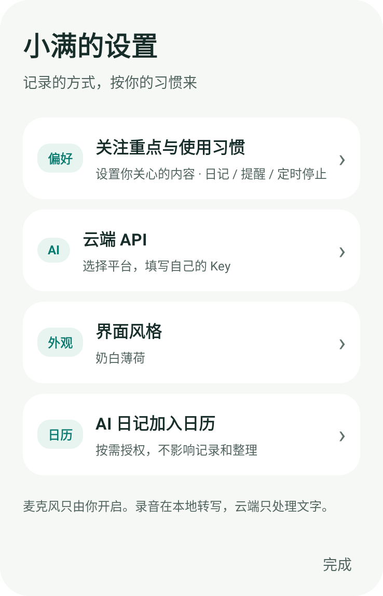
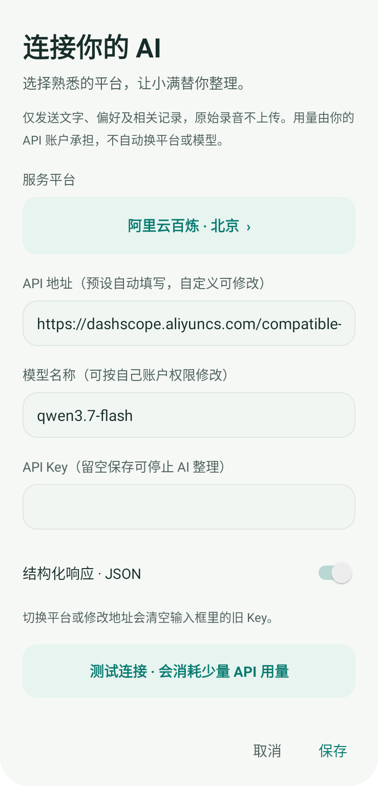
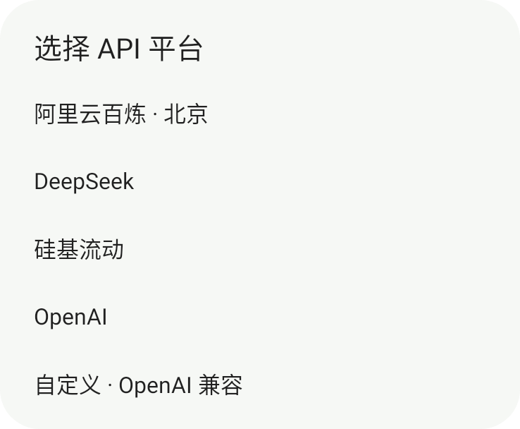
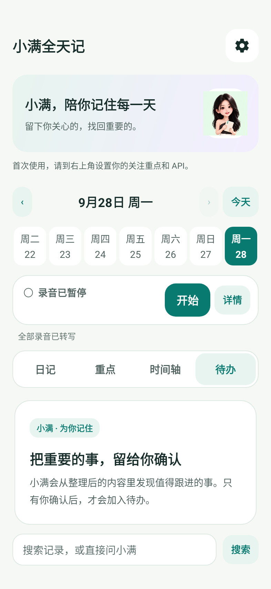

# 小满全天记 · 新版界面

[下载公开版 APK](https://github.com/haiyunw98-cloud/xiaoman-allday/releases/tag/v0.1.2-public) · [返回介绍](README.md)

以下为 v0.1.2 的真实 Android 控件测试渲染，不是绘制的概念界面，也不是手机实拍。全新安装状态，没有导入私人记录、密钥或虚构的日记内容。

## 奶白薄荷 / 深蓝夜色

小满陪你记录。开始、暂停和搜索留在首页，配置集中到右上角。

 

## 设置与关注重点

你希望留下什么，由你决定。不预设你的职业，也不把别人的配置带给你。

 

## 自选 API

主流平台预设，自定义兼容接口。填写自己的 Key，自行控制模型和费用。

 

## 日记、提醒与待办

日记风格、篇幅和提醒都可调整；候选待办只有你确认后才成为任务。日记默认每天 21:00 根据已整理内容生成，日历需单独授权；系统后台调度可能延后。

 

